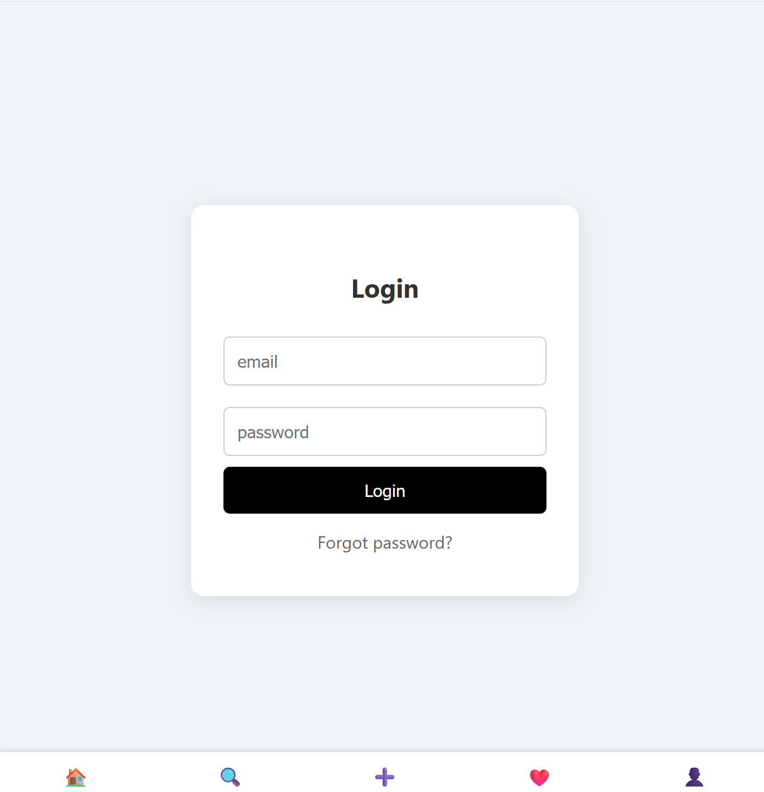

# Fashion - Website 

A stylish web application where users can share their outfits, get fashion inspiration, and check weather-based recommendations.

---

##  Features

-  User account creation and login with email and password  
-  Upload and share outfit pictures  
-  Check current weather to plan your fashion  
-  Personalized fashion recommendations  

---

##  Tech Stack

- **Frontend**: HTML, CSS, JavaScript, React  
- **Backend**: Node.js, Express.js  
- **Database**: SQL  

---

### Screenshots

### Defalut Page
 
**Showing every account**
==========================
    

 
 
  
  
  


##  Getting Started

To run this project locally:

1. Clone the repository:
   ```bash
   git clone https://github.com/ykawai1125/fashionWebsite.git
   cd fashionWebsite.git
   ```

##  Challenges

   One of the most challenging parts was connecting the database to the website for user output. When I first built the app, after a user uploaded a picture and clicked on it, the page didn’t display the image correctly. Additionally, all accounts were showing the same pictures. Solving this helped me understand how to manage user-specific data and improve database queries.
